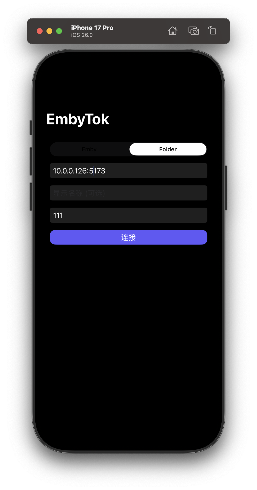
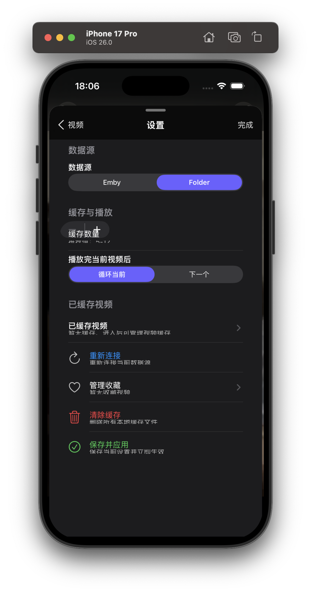

# EmbyTokNative (UIKit)

This folder contains:
- A native iOS/iPadOS UIKit app (`EmbyTokNative`) that plays Emby/Folder MP4 streams with AVPlayer.
- A native watchOS app target (`EmbyTokWatch`, minimum watchOS 10.6) with server connect, right-side pure mode + mute toggles, and disk cache prefetch.

## Open in Xcode
- Open `ios-native/EmbyTokNative.xcodeproj`.
- Set your `DEVELOPMENT_TEAM` in the target Signing & Capabilities.
- Ensure the device can reach your Emby/Folder server on the LAN.
- If you build the watch target, ensure watchOS platform components are installed in Xcode Settings > Components.

## Notes
- HTTP is allowed via `NSAppTransportSecurity` for local servers.
- The app preloads the next 2 videos and uses `AVPlayerItem.preferredForwardBufferDuration` for smoother playback.
- The watch app uses an on-device cache under `Caches/EmbyTokWatchCache` and prefetches current/next videos.
